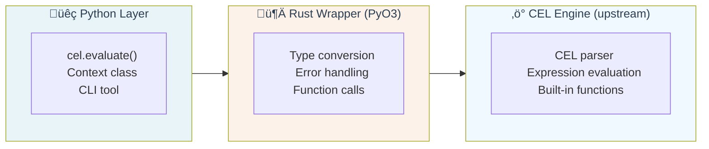

# Developer Guide

Welcome to the python-common-expression-language development guide! This document is for contributors who want to understand the codebase architecture, development workflow, and how we maintain compatibility with the upstream CEL specification.

## Project Architecture

### Core Components

This Python package provides bindings for Google's Common Expression Language (CEL) using a Rust backend:



**Key Files:**

- `src/lib.rs` - Main evaluation engine and type conversions
- `src/context.rs` - Context management and Python function integration  
- `python/cel/` - Python module structure and CLI
- `tests/` - Comprehensive test suite with 300+ tests

### Dependencies

- **[cel crate](https://crates.io/crates/cel)** v0.11.0 - The Rust CEL implementation we wrap
- **[PyO3](https://pyo3.rs/)** - Python-Rust bindings framework
- **[maturin](https://www.maturin.rs/)** - Build system for Python extensions

## Development Workflow

### Setup

```bash
# Clone and setup development environment
git clone https://github.com/hardbyte/python-common-expression-language.git
cd python-common-expression-language

# Install development dependencies
uv sync --dev

# Build the Rust extension
uv run maturin develop

# Run tests to verify setup
uv run pytest
```

### Code Organization

```
python-common-expression-language/
├── src/                    # Rust source code
│   ├── lib.rs             # Main module & evaluation engine
│   └── context.rs         # Context management
├── python/                # Python module
│   └── cel/               # Python package
├── tests/                 # Test suite (300+ tests)
│   ├── test_basics.py     # Core functionality
│   ├── test_arithmetic.py # Arithmetic operations
│   └── test_upstream_improvements.py  # Future compatibility
├── docs/                  # Documentation
└── pyproject.toml         # Python package configuration
```

### Testing Strategy

We maintain comprehensive test coverage across multiple categories:

```bash
# Run all tests
uv run pytest

# Run specific test categories
uv run pytest tests/test_basics.py        # Core functionality
uv run pytest tests/test_arithmetic.py    # Math operations  
uv run pytest tests/test_context.py       # Variable handling
uv run pytest tests/test_upstream_improvements.py  # Future compatibility

# Run with coverage
uv run pytest --cov=cel
```


## Upstream Compatibility Strategy

One of our key challenges is staying compatible with the evolving upstream `cel` crate while providing a stable Python API.

### Monitoring Upstream Changes

We use a proactive detection system to monitor for upstream improvements:

**Location**: `tests/test_upstream_improvements.py`

#### Detection Methodology

1. **Negative Detection**: Tests that verify current limitations still exist
2. **Positive Detection**: Expected failures (`@pytest.mark.xfail`) ready to pass when features arrive

```python
import pytest
import cel

# Example: Detecting when string functions become available  
def test_lower_ascii_not_implemented(self):
    """When this test starts failing, lowerAscii() has been implemented."""
    with pytest.raises(RuntimeError, match="Undefined variable or function.*lowerAscii"):
        cel.evaluate('"HELLO".lowerAscii()')

@pytest.mark.xfail(reason="String utilities not implemented in cel v0.11.0", strict=False)
def test_lower_ascii_expected_behavior(self):
    """This test will pass when upstream implements lowerAscii()."""
    assert cel.evaluate('"HELLO".lowerAscii()') == "hello"
```

#### Monitored Categories

| Category | Status | Impact |
|----------|--------|---------|
| **String Functions** (`lowerAscii`, `upperAscii`, `indexOf`, etc.) | 8 functions monitored | Medium - String processing |
| **Type Introspection** (`type()` function) | Ready to detect | Medium - Dynamic typing |
| **Mixed Arithmetic** (`int + uint` operations) | Comprehensive detection | Medium - Type safety |
| **Optional Values** (`optional.of()`, `?.` chaining) | Future feature detection | Low - Advanced use cases |
| **🚨 OR Operator** (CEL spec compliance) | **Critical behavioral difference** | **High - Logic errors** |
| **Math Functions** (`ceil`, `floor`, `round`) | Standard library functions | Low - Mathematical operations |

#### Running Detection Tests

```bash
# Check current upstream compatibility status
uv run pytest tests/test_upstream_improvements.py -v

# Look for XPASS results indicating new capabilities
uv run pytest tests/test_upstream_improvements.py -v --tb=no | grep -E "(XPASS|FAILED)"
```

**Interpreting Results:**
- **PASSED** = Limitation still exists (expected)
- **XFAIL** = Expected failure (ready for when feature arrives)  
- **XPASS** = 🎉 Feature now available! (remove xfail marker)

### Dependency Update Process

When updating the `cel` crate dependency:

1. **Run detection tests first** to identify new capabilities
2. **Update Cargo.toml** with new version
3. **Fix compilation issues** (API changes)
4. **Remove xfail markers** for now-passing tests  
5. **Update documentation** to reflect new features
6. **Test thoroughly** to ensure no regressions

## Code Style & Conventions

### Rust Code

```rust
// Follow standard Rust conventions
use ::cel::objects::TryIntoValue;
use ::cel::Value;

// Document complex functions
/// Converts a Python object to a CEL Value with proper error handling
pub fn python_to_cel_value(obj: &PyAny) -> PyResult<Value> {
    // Implementation...
}
```

### Python Code

```python
from typing import Optional, Union, Dict, Any, Callable
import cel

# Type hints for public APIs
def evaluate(expression: str, context: Optional[Union[Dict[str, Any], 'Context']] = None) -> Any:
    """Evaluate a CEL expression with optional context."""
    pass

# Comprehensive docstrings  
def add_function(self, name: str, func: Callable) -> None:
    """Add a Python function to the CEL evaluation context.
    
    Args:
        name: Function name to use in CEL expressions
        func: Python callable to invoke
        
    Example:
        >>> context = cel.Context()
        >>> context.add_function("double", lambda x: x * 2)
        >>> cel.evaluate("double(21)", context)
        42
    """
```

## Debugging & Troubleshooting

### Common Issues

**Build Failures:**
```bash
# Clean rebuild
uv run maturin develop --release

# Check Rust toolchain
rustc --version
cargo --version
```

**Test Failures:**
```bash
# Run with verbose output
uv run pytest tests/test_failing.py -v -s

# Debug specific test
uv run pytest tests/test_file.py::test_name --pdb
```

**Type Conversion Issues:**
```bash
# Check Python-Rust boundary
uv run pytest tests/test_types.py -v --tb=long
```

### Performance Profiling

```bash
# Basic performance verification
uv run pytest tests/test_performance_verification.py

# Memory profiling (if needed)
uv run pytest --profile tests/test_performance.py
```

## Release Process

1. **Version Bump** - Update version in `pyproject.toml`
2. **Changelog** - Document changes in `CHANGELOG.md`
3. **Release** - Create a release in GitHub to trigger publishing to PyPI

