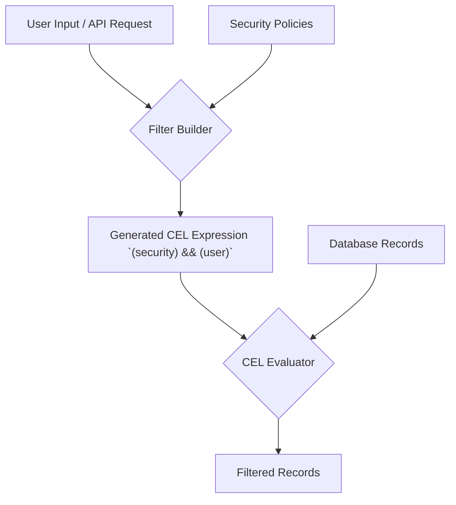

# Dynamic Query Filters

Learn how to build database queries dynamically based on user input and permissions, ensuring users can only access data they're authorized to see.

## Architecture Overview



## The Problem

Your application needs to build database queries dynamically based on user input and permissions. Users should be able to filter data with complex conditions, but you need to ensure they can only access data they're authorized to see.

## The CEL Solution

Use CEL to build safe, dynamic filters that combine user criteria with security constraints:

```python
import json
from cel import evaluate, Context

class DynamicQueryBuilder:
    """Build database queries dynamically using CEL expressions."""
    
    def __init__(self):
        self.base_security_filters = {
            "admin": "true",  # Admins see everything
            "manager": "record.department == user.department",
            "user": "record.user_id == user.id",
            "guest": "record.public == true"
        }
    
    def _format_value(self, value):
        """Format values correctly for CEL expressions."""
        if isinstance(value, str):
            return json.dumps(value)  # Handles quotes and escaping
        elif isinstance(value, bool):
            return "true" if value else "false"
        elif value is None:
            return "null"
        else:
            return str(value)  # Numbers
    
    def build_filter(self, user, user_filters):
        """Build a filter that combines security and user criteria."""
        
        # Get base security filter for user's role
        security_filter = self.base_security_filters.get(user["role"], "false")
        
        # Build user filter from criteria
        user_filter_parts = []
        for criterion in user_filters:
            field = criterion["field"]
            operator = criterion["operator"]
            value = criterion["value"]
            
            # Build CEL expression based on operator
            if operator == "equals":
                user_filter_parts.append(f'record.{field} == {self._format_value(value)}')
            elif operator == "contains":
                user_filter_parts.append(f'{self._format_value(value)} in record.{field}')
            elif operator == "greater_than":
                user_filter_parts.append(f'record.{field} > {self._format_value(value)}')
            elif operator == "less_than":
                user_filter_parts.append(f'record.{field} < {self._format_value(value)}')
            elif operator == "in_list":
                # value should be a list
                value_list = ', '.join(self._format_value(v) for v in value)
                user_filter_parts.append(f'record.{field} in [{value_list}]')
        
        # Combine user filters with AND
        user_filter = " && ".join(user_filter_parts) if user_filter_parts else "true"
        
        # Combine security filter with user filter
        combined_filter = f"({security_filter}) && ({user_filter})"
        
        return combined_filter
    
    def test_filter(self, filter_expression, user, sample_records):
        """Test filter against sample records."""
        context = Context()
        context.add_variable("user", user)
        
        matching_records = []
        for record in sample_records:
            context.add_variable("record", record)
            try:
                if evaluate(filter_expression, context):
                    matching_records.append(record)
            except Exception as e:
                print(f"Error evaluating filter for record {record.get('id', 'unknown')}: {e}")
        
        return matching_records

# Example usage
query_builder = DynamicQueryBuilder()

# Different users with different roles
admin_user = {"id": "admin1", "role": "admin", "department": "IT"}
manager_user = {"id": "mgr1", "role": "manager", "department": "Sales"}
regular_user = {"id": "user1", "role": "user", "department": "Sales"}

# User wants to filter for active sales records over $1000
user_filters = [
    {"field": "status", "operator": "equals", "value": "active"},
    {"field": "department", "operator": "equals", "value": "Sales"},
    {"field": "amount", "operator": "greater_than", "value": 1000}
]

# Sample data
sample_records = [
    {"id": "1", "user_id": "user1", "department": "Sales", "amount": 1500, "status": "active", "public": False},
    {"id": "2", "user_id": "user2", "department": "Sales", "amount": 800, "status": "active", "public": False},
    {"id": "3", "user_id": "user1", "department": "Marketing", "amount": 2000, "status": "active", "public": False},
    {"id": "4", "user_id": "user3", "department": "Sales", "amount": 1200, "status": "inactive", "public": False},
    {"id": "5", "user_id": "user4", "department": "Sales", "amount": 1800, "status": "active", "public": True}
]

# Build filters for different users
admin_filter = query_builder.build_filter(admin_user, user_filters)
# → "(true) && (record.status == \"active\" && record.department == \"Sales\" && record.amount > 1000)"

manager_filter = query_builder.build_filter(manager_user, user_filters)
# → "(record.department == user.department) && (record.status == \"active\" && record.department == \"Sales\" && record.amount > 1000)"

user_filter = query_builder.build_filter(regular_user, user_filters)
# → "(record.user_id == user.id) && (record.status == \"active\" && record.department == \"Sales\" && record.amount > 1000)"

print("Admin filter:", admin_filter)
print("Manager filter:", manager_filter)
print("User filter:", user_filter)

# Test filters
admin_results = query_builder.test_filter(admin_filter, admin_user, sample_records)
# → [{'id': '1', 'user_id': 'user1', 'department': 'Sales', 'amount': 1500, 'status': 'active', 'public': False}, 
#    {'id': '5', 'user_id': 'user4', 'department': 'Sales', 'amount': 1800, 'status': 'active', 'public': True}]

manager_results = query_builder.test_filter(manager_filter, manager_user, sample_records)
# → [{'id': '1', 'user_id': 'user1', 'department': 'Sales', 'amount': 1500, 'status': 'active', 'public': False},
#    {'id': '5', 'user_id': 'user4', 'department': 'Sales', 'amount': 1800, 'status': 'active', 'public': True}]

user_results = query_builder.test_filter(user_filter, regular_user, sample_records)
# → [{'id': '1', 'user_id': 'user1', 'department': 'Sales', 'amount': 1500, 'status': 'active', 'public': False}]

print(f"\nAdmin sees {len(admin_results)} records")
# → Admin sees 2 records
print(f"Manager sees {len(manager_results)} records")
# → Manager sees 2 records
print(f"User sees {len(user_results)} records")
# → User sees 1 records

# Verify expected results
assert len(admin_results) == 2  # Admin sees all matching records
assert len(manager_results) == 2  # Manager sees Sales records  
assert len(user_results) == 1  # User sees only their own record
assert user_results[0]["user_id"] == "user1"
# → All assertions pass

# Verify the filter expressions are constructed correctly  
assert "(true)" in admin_filter  # Admin has no restrictions
assert "record.department == user.department" in manager_filter  # Manager restricted by department
assert "record.user_id == user.id" in user_filter  # User restricted to own records
# → All filter validations pass

# Demonstrate different data types
# Demonstrate different data types
mixed_filters = [
    {"field": "active", "operator": "equals", "value": True},     # Boolean
    {"field": "score", "operator": "greater_than", "value": 85.5}, # Float
    {"field": "category", "operator": "in_list", "value": ["urgent", "sales"]}, # Check if field value is in list
    {"field": "notes", "operator": "equals", "value": None}      # Null
]

# This will generate correctly formatted CEL expressions:
filter_expr = query_builder.build_filter(admin_user, mixed_filters)
# → "(true) && (record.active == true && record.score > 85.5 && record.category in [\"urgent\", \"sales\"] && record.notes == null)"
# Individual parts:
# record.active == true
# record.score > 85.5  
# record.category in ["urgent", "sales"]
# record.notes == null

print("✓ Dynamic query filters working correctly")
# → ✓ Dynamic query filters working correctly
```

## Why This Works

- **Secure**: Security constraints are always applied regardless of user input
- **Flexible**: Users can build complex queries within their permissions  
- **Safe**: CEL prevents injection attacks and ensures expressions terminate
- **Testable**: Filters can be tested against sample data before deployment
- **Maintainable**: Query logic is separated from application code

## Best Practices

1. **Security first**: Always apply role-based filters before user filters
2. **Validate inputs**: Sanitize and validate all user filter inputs
3. **Test thoroughly**: Test filters with various user roles and data scenarios
4. **Handle type safety**: Use proper value formatting to prevent CEL syntax errors
5. **Graceful degradation**: Handle filter errors gracefully

## Key Implementation Details

### Value Formatting

The `_format_value()` method correctly handles different data types:

- **Strings**: Uses `json.dumps()` for proper quoting and escaping
- **Numbers**: Converts to string without quotes
- **Booleans**: Converts to CEL boolean literals (`true`/`false`)
- **None**: Converts to CEL `null` literal

### Security Layer

Security filters are applied first and cannot be bypassed:

- **Admin**: `"true"` - sees everything
- **Manager**: `"record.department == user.department"` - department-scoped access
- **User**: `"record.user_id == user.id"` - own records only
- **Guest**: `"record.public == true"` - public records only

### Combined Filter Pattern
The final expression always follows the pattern:
```cel
(security_filter) && (user_filter_1 && user_filter_2 && ...)
```

This ensures security constraints cannot be circumvented by user input.

## Related Topics

- [Access Control Policies](access-control-policies.md) - User permission patterns
- [Business Logic & Data Transformation](business-logic-data-transformation.md) - Validate filter configurations
- [Production Patterns & Best Practices](production-patterns-best-practices.md) - Security and performance patterns