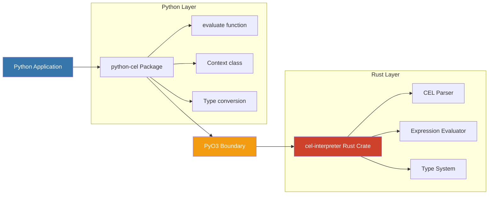

# Python CEL

**Fast, Safe CEL Evaluation for Python**

The Common Expression Language (CEL) is a non-Turing complete language designed for simplicity, speed, and safety. This Python package wraps the Rust implementation [cel-interpreter](https://crates.io/crates/cel-interpreter) v0.10.0, providing fast and safe CEL expression evaluation with seamless Python integration.

## Quick Start Paths

=== "🐍 Python Integration"

    ```python
    from cel import evaluate
    
    # Simple evaluation
    result = evaluate("age > 21", {"age": 25})
    assert result == True
    
    # Policy evaluation
    policy = "user.role == 'admin' || resource.public"
    result = evaluate(policy, {"user": {"role": "guest"}, "resource": {"public": True}})
    assert result == True
    
    # Working with nested data
    user_data = {
        "user": {
            "name": "Alice",
            "profile": {"verified": True, "role": "admin"}
        }
    }
    
    # Access nested fields
    name_check = evaluate("user.name == 'Alice'", user_data)
    assert name_check == True
    
    role_check = evaluate("user.profile.role", user_data)
    assert role_check == "admin"
    
    # Simple business logic
    policy = "user.profile.verified && user.profile.role == 'admin'"
    admin_access = evaluate(policy, user_data)
    assert admin_access == True
    
    print("✓ Basic CEL evaluation working correctly")
    ```

=== "⚡ Command Line"

    ```bash
    # Quick expressions
    cel '1 + 2'                              # → 3
    cel '"Hello " + "World"'                 # → Hello World
    cel '[1, 2, 3].size()'                  # → 3
    
    # With context
    cel 'age >= 21' --context '{"age": 25}'  # → true
    
    # Interactive REPL
    cel --interactive
    ```

=== "📖 CEL Language"

    ```cel
    // Basic types and operations
    1 + 2 * 3                    // → 7
    "hello" + " " + "world"      // → "hello world"
    [1, 2, 3][1]                // → 2
    {"name": "Alice"}.name       // → "Alice"
    
    // Conditionals and logic
    age >= 18 ? "adult" : "minor"
    has(user.email) && user.email.endsWith("@company.com")
    
    // Collection operations
    users.filter(u, u.active).all(u, u.verified)
    emails.exists(e, e.endsWith("@company.com"))
    
    // Built-in functions
    size([1, 2, 3])              // → 3
    timestamp("2024-01-01T00:00:00Z")
    duration("1h30m")
    ```
    
    **[📖 Complete Syntax Reference →](tutorials/cel-language-basics.md)**

## Why Python CEL?

### 🚀 **Performance**
Built on Rust with PyO3 - evaluate expressions in **microseconds**, not milliseconds.

| Expression Type | Evaluation Time | Throughput | vs Pure Python |
|-----------------|----------------|------------|----------------|
| **Simple** (`x + y * 2`) | 5-15 μs | 50,000+ ops/sec | **~10x faster** |
| **Complex** (multi-condition policies) | 15-40 μs | 25,000+ ops/sec | **~20x faster** |
| **Function calls** (with custom Python functions) | 20-50 μs | 20,000+ ops/sec | **~5x faster** |
| *Pure Python equivalent* | *100-800 μs* | *1,000-10,000 ops/sec* | *baseline* |

*Performance varies by hardware. [Run your own benchmarks →](how-to-guides/production-patterns-best-practices.md#performance-benchmarking)*

### 🛡️ **Safety**
Safe by Design: Built on a memory-safe Rust core. The non-Turing complete nature of CEL prevents infinite loops, and comprehensive error handling traps evaluation errors as Python exceptions.

### 🎯 **Production Ready**
200+ tests, comprehensive CLI, type safety, and ~80% CEL compliance with transparent documentation.

### 🔧 **Developer Friendly**
Dual interfaces (Python API + CLI), rich error messages, extensive documentation, and full IDE support.

## Architecture

Python CEL leverages a high-performance Rust core wrapped with PyO3 for seamless Python integration:



**Why This Architecture?**

- **🚀 Speed**: Rust's zero-cost abstractions deliver microsecond-level performance
- **🛡️ Safety**: Memory-safe Rust prevents crashes and security vulnerabilities  
- **🔧 Ergonomics**: PyO3 provides seamless Python integration with automatic type conversion
- **📦 Distribution**: Single wheel package with no external dependencies  

## Installation

```bash
pip install common-expression-language
```

After installation, both the Python library and the `cel` command-line tool will be available.

## Real-World Example: Access Control

```python
from cel import evaluate

# Multi-factor access control policy
policy = """
    user.verified && 
    (user.role == "admin" || resource.owner == user.id || resource.public)
"""

# Test different scenarios
admin_user = {"user": {"role": "admin", "verified": True, "id": "admin1"}, "resource": {"owner": "bob", "public": False}}
owner_user = {"user": {"role": "user", "verified": True, "id": "alice"}, "resource": {"owner": "alice", "public": False}}
guest_user = {"user": {"role": "guest", "verified": True, "id": "guest1"}, "resource": {"owner": "bob", "public": True}}

assert evaluate(policy, admin_user) == True   # Admin access
assert evaluate(policy, owner_user) == True   # Owner access  
assert evaluate(policy, guest_user) == True   # Public access

print("✓ Access control policies working correctly")
```

Simple, readable policies that handle complex business logic.

→ [Learn Enterprise-Grade Access Control](how-to-guides/access-control-policies.md)

## Next Steps

🚀 **Get Started:**
- [**Installation**](getting-started/installation.md) - Get up and running in 2 minutes
- [**Quick Start**](getting-started/quick-start.md) - Your first CEL expressions

📚 **Learn CEL:**
- [**Thinking in CEL**](tutorials/thinking-in-cel.md) - Core concepts and philosophy
- [**CEL Language Basics**](tutorials/cel-language-basics.md) - Complete syntax reference
- [**Your First Integration**](tutorials/your-first-integration.md) - Python API fundamentals
- [**Extending CEL**](tutorials/extending-cel.md) - Advanced context and custom functions

🛠️ **Solve Problems:**
- [**Access Control Policies**](how-to-guides/access-control-policies.md) - Sophisticated permission systems
- [**Production Patterns & Best Practices**](how-to-guides/production-patterns-best-practices.md) - Comprehensive production guide
- [**Business Logic & Data Transformation**](how-to-guides/business-logic-data-transformation.md) - Transform data and implement business rules
- [**Dynamic Query Filters**](how-to-guides/dynamic-query-filters.md) - Build safe, dynamic queries
- [**Error Handling**](how-to-guides/error-handling.md) - Robust error handling strategies

---

*Built with ❤️ using [PyO3](https://pyo3.rs/) and [cel-interpreter](https://crates.io/crates/cel-interpreter)*